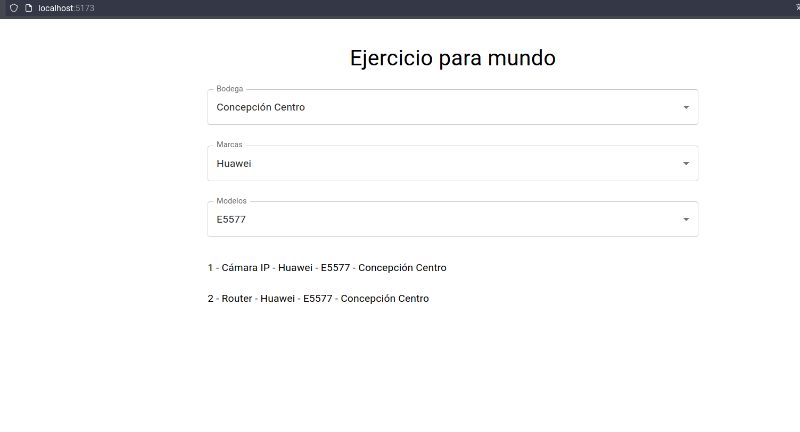

# bodegaWEB
Front-end en [Vite + ReactJS](https://vitejs.dev/guide/) de prueba técnica de reclutamiento a Mundo.

IMPORTANTE: Para que el proyecto funcione correctamente, es necesario instalar y arrancar la [bodegaAPI](https://github.com/fariascl/bodegaAPI).

**Autor: Alejandro Farías**

## Instalación

Para comenzar, es necesario tener `Git` y `Node (v18.15)` instalado en el sistema.

De ser así, lo primero que hay que hacer es clonar el repositorio:

`git clone https://github.com/fariascl/bodegaWEB.git`

Luego, se accede al directorio donde fue clonado el proyecto:

`cd /donde/esta/el/repo`

Estando en el directorio del repositorio, se accede a la carpeta donde está el código fuente:

`cd bodegaWEB/`

Y allí se procede a instalar los paquetes, que están descritos en el `package.json`

`npm i`

Para finalizar, se debe levantar el proyecto en modo dev:

`npm run dev`

Si todo resulta satisfactoriamente, se podrá visualizar a través de `http://localhost:5173`

